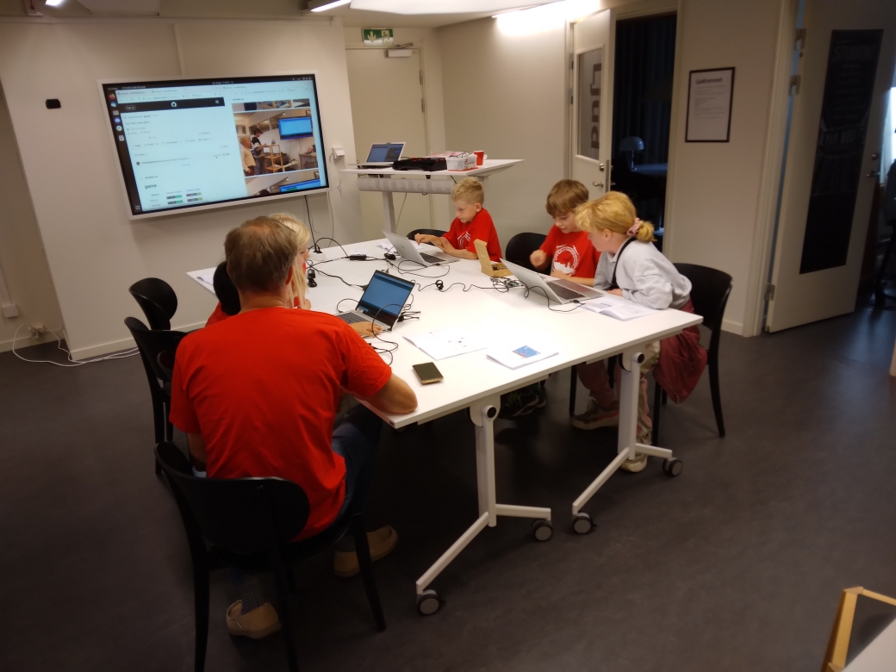
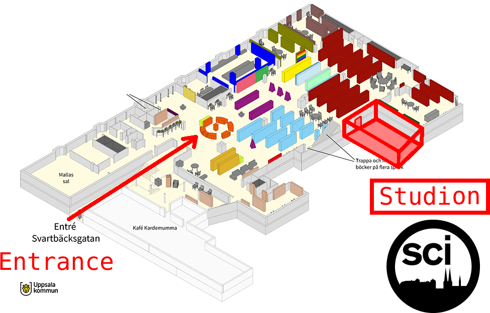

# 2024-09-14 Kulturnatten

> Så här ser det ut när första gästen har kommit in.
> Vi är folket i de röda T-shirtsen!

* Målet: att undervisa programmering för Kulturnattens besökare
* Vem: eleverna från Programmeringskursen
* Var: [Uppsala Stadsbibliotek](https://bibliotekuppsala.se/web/arena/stadsbiblioteket), 
  (Svartbäcksgatan 17, 753 75 Uppsala) i rum Studion (se bild nedan)
* Tider: 11.00-19.00 (men eleverna undervisar bara under vissa timmar :-) )
* Kontaktperson: Ellen Lejman

OBS! Hos Makerspace finns också andra aktiviteter att delta i.

> Vi håller till i Uppsala Stadsbibliotek i rum Studion.

## Vanliga frågor

### När är jag välkommen?

Du är välkommen när som helst mellan klockan 11:00 och 19:00.

Här är schemat:

När        | Vem
-----------|------------------
11:00-12:00| Richel
12:00-13:00| Richel
13:00-14:00| Richel
14:00-15:00| Richel
15:00-16:00| Richel
16:00-17:00| Richel
17:00-18:00| Richel
18:00-19:00| Richel

### Hur länge behöver jag hjälpa till?

Om du hjälper till en timme är Richel redan riktigt nöjd. 

Redan om du undervisar en person får du en Uppsala Makerspace T-shirt (vi ska skapa den under lektionen!).

Men om du kan och vill, får du gärna hjälpa till under hela evenemanget. Eller ta en rast och kom tillbaka senare.

### Vad ska vi göra?

Vi ska undervisa Arduino, Blender och/eller programmering.

### Vad behöver jag ta med?

Kort svar: ingenting :-). Du kan ta med egna saker på egen risk.

* Mat och dryck: Richel fixar det åt dig. Vill du ta med egen dryck och mat är det inget problem.
* Dator: vi har tillräckligt med datorer (sex stycken, för att vara exakt). Om du verkligen vill använda din egen, går det bra, men du är säkrare om du använder Makerspaces datorer (OBS: inget har någonsin hänt med kursdatorerna, men vi kan aldrig vara helt säkra).
* Arduino: samma sak som med datorerna. Du får visa upp dina Arduino-projekt, men vi kan inte garantera att dina saker är helt säkra.
